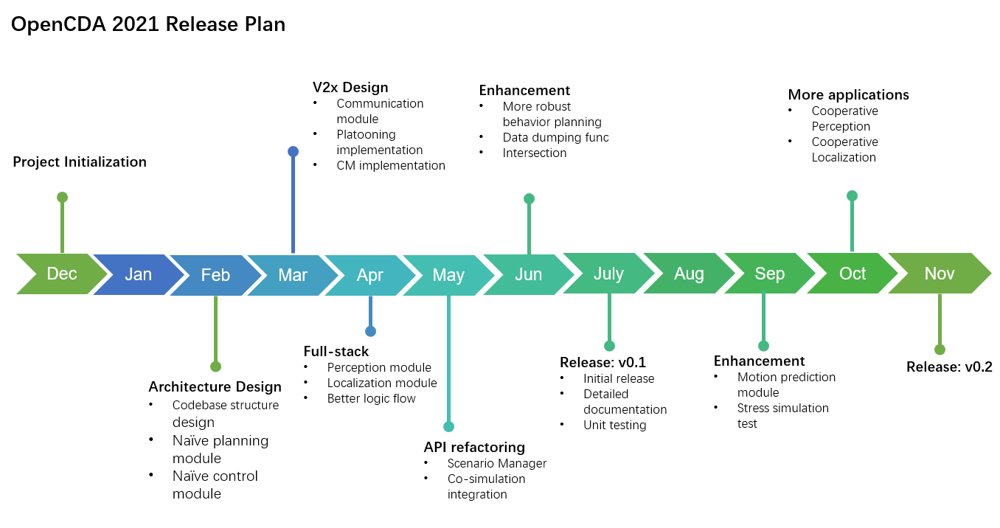

# OpenCDA
[](https://travis-ci.com/ucla-mobility/OpenCDA)
[](https://coveralls.io/github/ucla-mobility/OpenCDA?branch=feature/readme_revise)
[](https://opencda-documentation.readthedocs.io/en/latest/?badge=latest)


OpenCDA is a generalized framework for prototyping <strong>cooperative driving automation (CDA; see [SAE J3216](](https://www.sae.org/standards/content/j3216_202005/)))
applications</strong> (e.g., cooperative perception, platooning) as well as <strong>automated driving components</strong> (e.g., 
perception, localization, planning, control) integrated with automated driving simulation (CARLA), traffic simulation (SUMO), and <strong>Co-simulation</strong> (CARLA + SUMO). OpenCDA builds upon standard automated driving system (ADS) platforms and focuses on various classes of data exchanges and cooperation between vehicles, infrastructure, and other road users (e.g., pedestrians).

The goal of the OpenCDA project is to enable researchers and engineers to prototype any cooperative driving applications using our full-stack CDA platform and test them from both automated driving and traffic operations perspectives. OpenCDA bridges the gaps between the communities of automated driving and transporation engineering. Eventually, OpenCDA can be used to develop and test cooperative driving functions and applications for improving safety, sustainability, and efficiency of future transportation systems.


The key features of OpenCDA are:
* <strong>Full-stack CDA System</strong>: OpenCDA provides a full-stack automated driving and cooperative driving software system that contains perception, localization, planning, control, and V2X communication modules. 
* <strong>Connectivity and Cooperation</strong>: OpenCDA supports various levels and categories of cooperation between CAVs in simulation.
  This differentiates OpenCDA with other single vehicle automation tools.
* <strong>Integration</strong>: OpenCDA utilizes CARLA and SUMO separately, as well as integrates them together for realistic scene rendering, vehicle modeling, and traffic simulation. It is also efficient and flexible enough to be applied for software-in-the-loop and hardware-in-the-loop testing.
* <strong>Modularity</strong>: OpenCDA is highly modularized, enabling users to conveniently replace any default algorithms or protocols with their own customzied design. 
* <strong>Benchmark</strong>: OpenCDA offers benchmark testing scenarios, benchmark baseline maps, state-of-the-art benchmark algorithms for ADS and Cooperative ADS functions, and benchmark evaluation metrics.


 
Users could refer to [OpenCDA documentation](https://opencda-documentation.readthedocs.io/en/latest/) for more details.

## Major Components


OpenCDA  consists of three major component: <strong>Cooperative Driving System</strong>,  <strong>Co-Simulation Tools</strong>,
and  <strong>Scenario Manager</strong>.

Check the [OpenCDA Introduction](https://opencda-documentation.readthedocs.io/en/latest/md_files/introduction.html) for more details.


 ## Citation
 If you are using our OpenCDA framework or codes for your development, please cite the following paper:
 ```bibtex
@inproceedings{xu2021opencda,
title={OpenCDA:  An  Open  Cooperative  Driving  Automation  Framework
Integrated  with  Co-Simulation},
author={Runsheng Xu, Yi Guo, Xu Han, Xin Xia, Hao Xiang, Jiaqi Ma},
booktitle={2021 IEEE Intelligent Transportation Systems Conference (ITSC)},
year={2021}
}
```
The arxiv link to the paper:  https://arxiv.org/abs/2107.06260

Also, under this LICENSE, OpenCDA is for non-commercial research only. Researchers can modify the source code for their own research only. Contracted work that generates corporate revenues and other general commercial use are prohibited under this LICENSE. See the LICENSE file for details and possible opportunities for commercial use.
## Get Started

 


### Users Guide
* [Overview](https://opencda-documentation.readthedocs.io/en/latest/md_files/introduction.html)
* [Installation](https://opencda-documentation.readthedocs.io/en/latest/md_files/installation.html)
* [Quick Start](https://opencda-documentation.readthedocs.io/en/latest/md_files/getstarted.html)
* [Logic Flow](https://opencda-documentation.readthedocs.io/en/latest/md_files/logic_flow.html)
* [Traffic Generation](https://opencda-documentation.readthedocs.io/en/latest/md_files/traffic_generation.html)


Note: We continuously improve the performance of OpenCDA. Currently, it is mainly tested in our customized maps and
 Carla town06 map; therefore, we <strong>DO NOT </strong> guarantee the same level of  robustness in other maps.

### Developer Guide

*  [Class Design](https://opencda-documentation.readthedocs.io/en/latest/md_files/developer_tutorial.html)
*  [Customize Your Algorithms](https://opencda-documentation.readthedocs.io/en/latest/md_files/customization.html)
*  [API Reference](https://opencda-documentation.readthedocs.io/en/latest/modules.html) <br>


### Contribution Rule
We welcome your contributions.
- Please report bugs and improvements by submitting issues.
- Submit your contributions using [pull requests](https://github.com/ucla-mobility/OpenCDA/pulls).
 Please use [this template](.github/PR_TEMPLATE.md) for your pull requests.
 
## In OpenCDA v0.1.0 Release
The current version features the following:
* OpenCDA v0.1.0 software stack (basic ADS and cooperative ADS platform, benchmark algorithms for platooning, cooperative lane change, merge, and other freeway maneuvers)
* CARLA only simulation
* Co-Simulation function with CARLA + SUMO
* Scenario manager and scenario database for CDA freeway applications


## In Future Releases
Future versions are expected to include the following:
* OpenCDA v0.2.0 and above software stack, including signalized intersection and corridor applications, cooperative perception and localization, enhanced scenario generation/manager and scenario database for newly added CDA applications)
* SUMO only simulation which includes SUMO impplementation of all cooperative driving applications using behavior based approach (consistent with CARLA implementation)
* Software-in-the-loop interfaces with two open-source ADS platforms, i.e., Autoware and CARMA
* hardware-in-the-loop interfaces and example projects with a real automated driving vehicle platform and a driving simulator

<!-- ## 2021 RoadMap

-->

## Contributors
OpenCDA is supported by the [UCLA Mobility Lab](https://mobility-lab.seas.ucla.edu/). <br>

### Lab Principal Investigator:
- Dr. Jiaqi Ma ([linkedin](https://www.linkedin.com/in/jiaqi-ma-17037838/),
               [UCLA Samueli](https://samueli.ucla.edu/people/jiaqi-ma/))

### Project Lead: <br>
 - Runsheng Xu ([linkedin](https://www.linkedin.com/in/runsheng-xu/), [github](https://github.com/DerrickXuNu))  <br>
 
### Team Members: 
 - Xu Han ([linkedin](https://linkedin.com/in/xu-han-12851a64), [github](https://github.com/xuhan417))
 - Hao Xiang ([linkedin](https://www.linkedin.com/in/hao-xiang-42bb5a1b2/), [github](https://github.com/XHwind))
 - Dr. Yi Guo ([linkedin](https://www.linkedin.com/in/yi-guo-4008baaa/))
 - Dr. Xin Xia ([linkedin](https://www.linkedin.com/in/yi-guo-4008baaa/))
 

