# LGCP Workflow and Area-Task Group Semantics

## 目的

本文档为论文 revision 准备一版可直接转写的 workflow figure 和机制说明，重点回应以下审稿意见：

- LGCP workflow 不够清楚；
- group 容易被误解为传统 disjoint clustering；
- 一个 CAV 参与多个 group 时 packet granularity、去重和复用机制不清楚；
- leader-to-RSU upload 的优先级、可靠性和失败处理需要解释。

## Workflow Figure Draft

```mermaid
flowchart LR
    A["RSU partitions perception ROI into spatial areas"]
    B["CAVs estimate per-area confidence from local observation"]
    C["CAVs upload compact pose / direction / confidence reports"]
    D["RSU builds overlapping area-task groups"]
    E["RSU selects one leader for each area-task group"]
    F["Members send area-specific feature slices to leaders"]
    G["Leaders perform local area fusion"]
    H["Leaders upload fused area results to RSU"]
    I["RSU aggregates global perception view"]
    J["RSU broadcasts global view / task update"]

    A --> B --> C --> D --> E --> F --> G --> H --> I --> J
    D -. "same CAV may serve multiple areas" .-> F
    H -. "higher priority than raw member slices" .-> I
```



建议论文图中将上图拆成三层：

1. **Sensing / confidence report layer**：ROI partition、CAV observation、confidence report。
2. **Area-task group layer**：overlapping area-task group、leader selection、member-to-leader upload。
3. **Local-to-global fusion layer**：leader local fusion、leader-to-RSU upload、RSU global aggregation、broadcast。

这样可以避免读者把 LGCP 看成简单的 hierarchical clustering。

## Area-Task Group, Not Traditional Clustering

LGCP 中的 group 应命名为 **area-task group**。它不是传统 clustering，区别如下：

| 维度 | Traditional vehicle clustering | LGCP area-task group |
| --- | --- | --- |
| 分组对象 | vehicles | area-specific perception tasks |
| 是否互斥 | 通常互斥，每车属于一个 cluster | 可重叠，一个 CAV 可参与多个 area group |
| 分组目标 | 网络组织、簇头管理、局部协作 | 为每个 spatial area 选择足够可靠的感知贡献者 |
| leader 含义 | cluster head | area fusion leader |
| 上传内容 | vehicle-level message / feature | area-specific feature slice or fused area result |

论文推荐表述：

```text
LGCP does not form disjoint vehicle clusters. Instead, it constructs overlapping
area-task groups, where each group corresponds to one spatial perception area
and includes the CAVs that can contribute complementary observations to that
area. Therefore, a CAV may participate in multiple groups, but each membership
is tied to an area-specific feature slice rather than a duplicate vehicle-level
upload.
```

## Packet Granularity

当一个 CAV 参与多个 area-task group 时，packet 的逻辑粒度应定义为：

```text
(frame_id, source_cav_id, target_id, area_id, upload_stage)
```

其中：

- `frame_id`：对应 perception update cycle；
- `source_cav_id`：发送者；
- `target_id`：leader CAV 或 RSU；
- `area_id`：该 packet 服务的 spatial area；
- `upload_stage`：`member_to_leader` 或 `leader_to_rsu`。

当前 `upload_plan.csv` 已按该粒度记录 `timestamp, area_id, source_id, target_id, upload_type, bytes`。这说明同一个 CAV 在同一帧中可以为多个 area 发送不同 area-specific feature slice，而不是重复发送完整 raw observation。

## Reuse and Deduplication

为了避免一个 CAV 因参与多个相邻 area 而重复发送高度重叠的数据，论文中可加入以下机制说明：

1. **Area-slice indexing**：每个 feature slice 使用 `(frame_id, source_cav_id, area_id)` 标识。
2. **Adjacent-area batching**：若同一 source CAV 向同一 target 上传多个相邻 area slice，可打包成一个 batched packet，并携带多个 `area_id`。
3. **Feature cache at leader / RSU**：leader 和 RSU 维护短时 frame-level cache；已接收的 `(frame_id, source_cav_id, area_id)` 不重复处理。
4. **Shared backbone feature reuse**：若多个 area slice 来自同一底层 BEV feature map，可只传共享 backbone crop 加 area mask / index，减少重复字节。

论文推荐保守口径：

```text
Our current implementation accounts for area-specific packets explicitly in
the upload plan. When multiple requested areas share the same source-target
pair, LGCP can batch adjacent slices and use frame-level cache keys to avoid
duplicate processing. We leave model-specific feature packing as an engineering
optimization and account for it conservatively in the byte proxy.
```

## Leader-to-RSU Upload Priority

Leader-to-RSU packets 携带 local fused area result，重要性高于 member-to-leader raw slice。论文中应明确：

- leader-to-RSU upload 是每个 area 最终进入 RSU global view 的关键路径；
- leader result packet 通常小于 member feature slice，但更重要；
- scheduling 时应优先保障高 priority area 和已完成 local fusion 的 leader result；
- 若 leader-to-RSU 失败，该 area 会缺失 fused result，RSU 可选择 stale fallback 或低置信度单车 fallback。

建议优先级排序：

1. high-priority area 的 leader-to-RSU result；
2. high-priority area 缺失成员的 member-to-leader slice；
3. low-priority area 的 leader-to-RSU result；
4. low-priority area 的 member-to-leader slice。

## Failure Handling

| Failure mode | Detection signal | Fallback |
| --- | --- | --- |
| member-to-leader loss | leader cache timeout | leader fuses available members only |
| leader-to-RSU loss | RSU missing `(frame_id, area_id)` result | stale area result or best single-CAV area result |
| leader CAV unavailable | missing heartbeat / pose report | RSU reassigns leader in next cycle |
| stale assignment | CAV displacement exceeds threshold | reduce assignment TTL or re-run grouping |
| duplicate area packet | duplicate `(frame_id, source, area, stage)` | cache-based deduplication |

## Paper Placement

- Workflow figure：Framework / System Overview。
- Area-task group definition：Problem Formulation 或 Solution Overview。
- Packet granularity and reuse：Communication Model 或 System Implementation。
- Leader-to-RSU priority and failure handling：Scheduling / Reliability Discussion。

## 当前实现状态

已落地：

- `area_assignment_plan.csv` 显式记录 area-task group、leader 和 confidence；
- `upload_plan.csv` 显式记录 `(timestamp, area_id, source_id, target_id, upload_type, bytes)`；
- NS3 replay 可将 `upload_plan.csv` 转换为 request-level transfer；
- RLC / PSSCH / HARQ trace 已可映射回 `upload_plan.csv` request。

未落地：

- 真实 area-specific feature slicing；
- leader local fusion 的模型级实现；
- RSU global aggregation 的模型级实现；
- adjacent-area batching 的实际编码与解码。

因此论文中应把这些机制作为 LGCP protocol design / planned implementation semantics，而不要声称当前 offline prototype 已完成所有模型级 feature packing。
