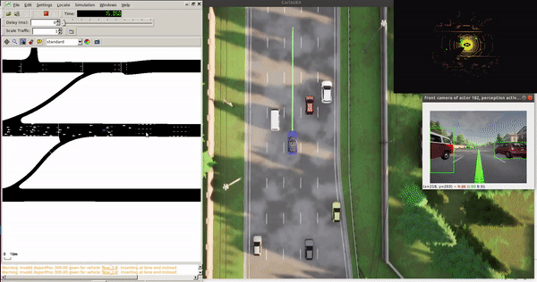
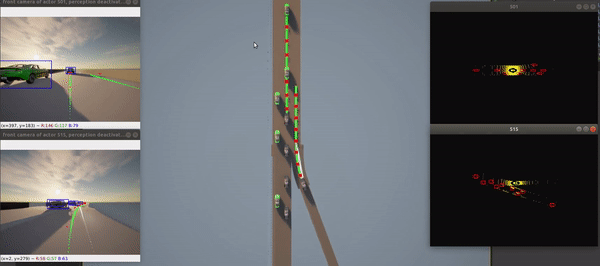
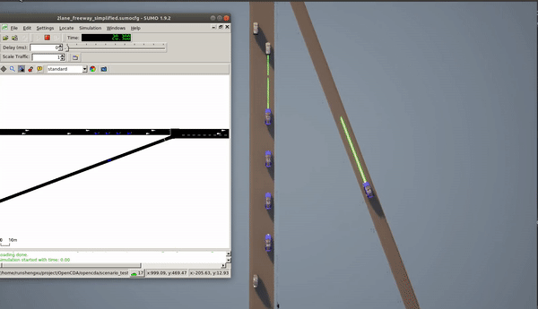

## Quick Start 

OpenCDA provides benchmark scenarios that researchers can use directly without any modification. Running these 
scenario testings only need one line of command:
```she
cd ~/OpenCDA
python opencda.py -t scenario_name --aply_ml --record
```
Parameters explanation:
* `-t`: The name of the tesitng scenario. A python script with the same name should exist in
`opencda/scenario_testing/` to construct the simulation, and a yaml file with the same name should exist in 
`opencda/scenario_testing/config_yaml/` to define the simulation parameters.
* `--apply_ml(Optional)` : A flag to indicate whether a deep learning model needs to be loaded. If this flag is 
set, Pytorch will be imported.
* `--record(Optional)` : A flag to indicate whether to record this simulation. [Check here for more details](https://carla.readthedocs.io/en/latest/adv_recorder/).

Below we will demonstrate some examples of running the benchmark testings in OpenCDA

---
### Single Vehicle Test
####  1. Two-lane highway test
```sh
python opencda.py -t single_2lanefree_carla
```
In this scenario , a single Connected Automated Vehicle will be spawn at a 2-lane highway customized map.  This
CAV will try to reach the assigned destination with a desired speed of 100km/h and manage to safely interact
with the surrounding traffic flow. The CAV's localization, planning, and control modules will be activated, and the perception module will be deactivated
by default, thus <strong> pytorch is NOT required in this testing </strong>. <br>

If you want to activate the perception module, please check [Yaml Defining Rules](yaml_define.md) to see details.


> [!NOTE]
> The bounding boxes draw on the camera and lidar are retrieved from the server directly and 
> projected to the sensor space.

``` important:: Its a note! in markdown!

```

``` important:: Its a note! in markdown!
TEST

```

#### 2. Town06 test (Pytorch required)
```sh
python opencda.py -t single_town06_carla --apply_ml
```
The apply_ml flag will import the pytorch library and load Yolov5 model (<strong>Thus Pytorch is required</strong>) for object detection. Thus, in this
scenario, the <strong>perception</strong>, localization, planning and control modules will all be activated.


<strong>Note: The bounding box draw here comes from the detection model.</strong>

#### 3. Town06 Co-simulation test (Pytorch and Sumo required)
```sh
python opencda.py -t single_town06_cosim --apply_ml
```
This scenario applies <strong>Sumo</strong> to generate the traffic flow instead of using Carla traffic manager.
Yolov5 and simple Lidar fusion are used to detect object 3D bounding box. Therefore, both
Pytorch and Sumo are required to install to run this benchmark test.


---
### Cooperative Driving Test
#### 1. Platooning stability test
```sh
python opencda.py -t platoon_stability_2lanefree_carla
```
In this scenario, a platoon with 4 members will be placed at the 2-lane highway map. The platoon leader will dramatically increases
and decreases its speed to test whether the members can still keep the desired time gap. In this way, the platoon
stability is verified.

#### 2. Cooperative merge and join a platoon
```sh
python opencda.py -t platoon_joining_2lanefree_carla
```
In this scenario, a platoon will drive on the mainline together with a mixed traffic flow. A single CAV will come from the 
merging lane, communicate with the platoon to cooperatively merge into the mainline, and simultaneously join the platoon.



#### 3. Cooperative merge and join a platoon under co-simulation(Sumo required)
```sh
python opencda.py -t platoon_joining_2lanefree_cosim
```


#### 4. Platoon back-join(Pytorch required)
```sh
python opencda.py -t platoon_town06_carla.py
```
A single CAV will try to overtake several human-drive vehicles to join the platoon from the back side.
Pytorch is required for this test since we use yolov5 detetion.
